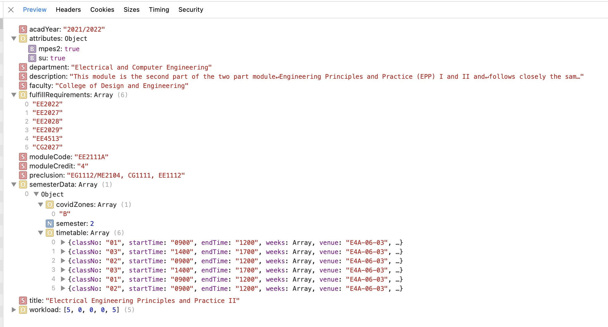
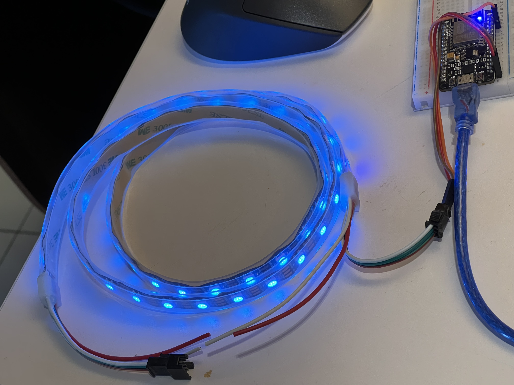
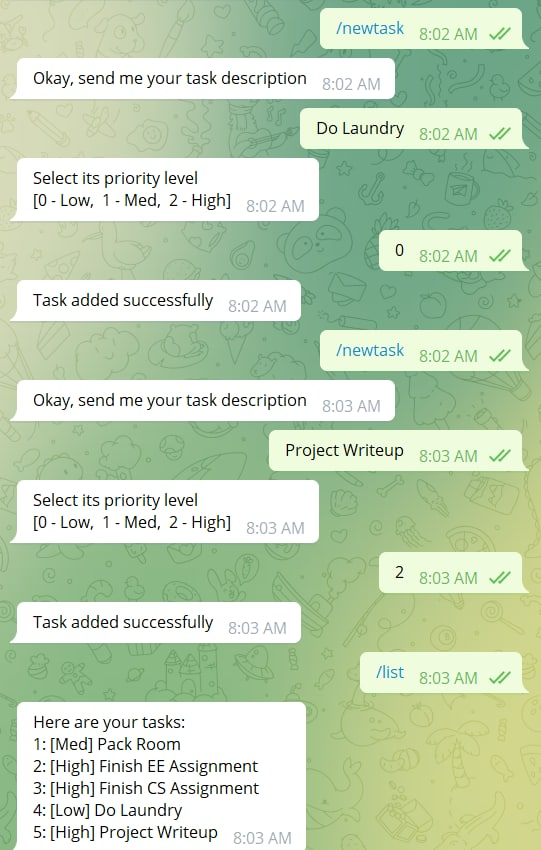
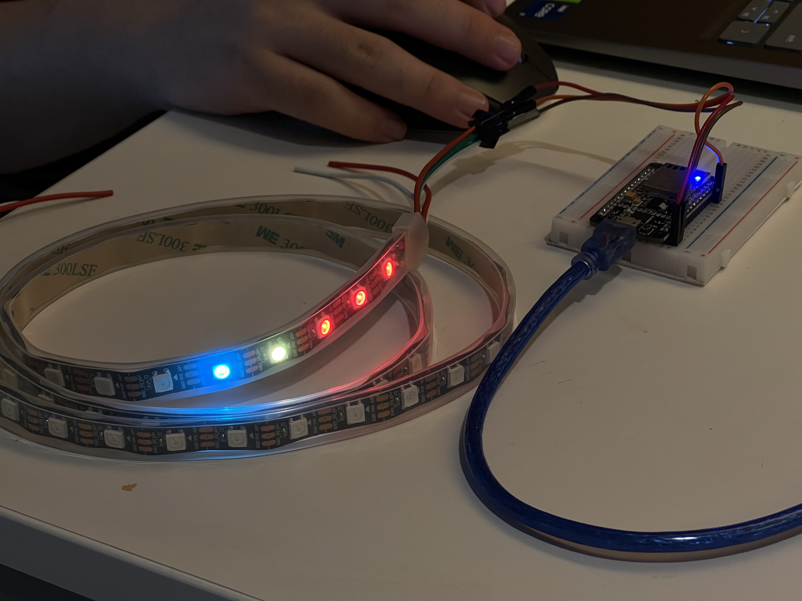

# LED Task Bot

## Team

Team **#96A Hackuna Matata**

|Name       |ID    |
|:---------:|:----:|
|Ng Ho Chi  |#156A |
|Teoh Xu En |#347L |
|Chen Xihao |#433N |

## Description

Our project implements a Telegram bot that controls a 3-in-1 hardware system on chip that infuses convenience and simplicity, making it fun and easy to keep your life organised.

## Components

The Telegram bot consists of 3 features

- A Module Timetable Reminder System,
- A Healthy Living Encouragement Tool, and
- A Task Prioritization Organiser.

### Timetable Reminder System

Users can add modules to the system by inputting the module code and class number of their selected module into the Telegram bot.

Our system will query the [NUS Mods API](https://api.nusmods.com/v2/) to get timing information about each module and class code entered.

Based on the information from the API endpoint (an example is shown in the picture below), we can obtain the timings and days where the lessons will take place.

Then, our ESP8266 will keep track of the time and remind people about their lessons when their lessons are about to start by flashing the LED lights repeatedly in red about 5 minutes before a lesson start. No reason to go to class late anymore!

### Healthy Living Encouragement Tool

Sitting around too long is bad for your health. That's why our Healthy Living Encouragement Tool surprises you with random reminders to do things that are beneficial to your health.

Just input the number of reminders you want the bot to have, as well as the time range you want to be reminded. Our bot will take care of the rest by repeatedly flashing a strip of green (exercise) or cyan (drink water) LEDs.

### Task Prioritization Organiser

Are you always unsure about how many tasks you have to complete at any given moment? Want to have fun but afraid of missing an important deadline? No problem! Our Task Prioritization Organiser makes it super simple to keep track of how many tasks you have, as well as how important each of those tasks are.

We denote each task using a single LED bulb. Low priority tasks are shown in cyan, medium ones are in orange and each high priority task lights up a red bulb. Bulbs are updated in real time, as tasks are added or marked as completed.

Only a few cyan LED lights show up? That's a cue that you can go have fun. But rack up too many red LED lights and you'll have to spend your time at home finishing your tasks.

Here, we've added 3 high priority tasks (red), 1 medium priority task (yellow) and 1 low priority task (cyan).

    
    

## Motivation

We challenged ourselves to keep to as low of a budget as possible while still coming up with something that people would feel is useful. Something that we felt would fit this criteria would be a minimalistic system for self-organisation. In totum, the LED strip and the ESP8266 cost around a mere $15.

## Technology and Frameworks Used

### Hardware

To build our bot, we used the [ESP8266](https://www.espressif.com/en/products/socs/esp8266), as well as a strip of LED lights.

### Software

The [Arduino IDE](https://www.arduino.cc/en/software) and C++ are used to write the core software for this project. We rely mainly on the following libraries:

- [CTBot](https://github.com/shurillu/CTBot): Telegram bot to handle communcation between ESP8266 and user.
- [FastLED](https://fastled.io): offers control to the connected LED strip from the ESP8266 board.

Source file located in [`LEDTaskBot/telebot/telebot.ino`](./telebot/telebot.ino).

## Challenges we ran into

- Limited memory on the SoC
- Limited processing power
- Untimely response from the telegram bot
- HTTP requests using C++ and parsing JSON response were a pain in the ass...
