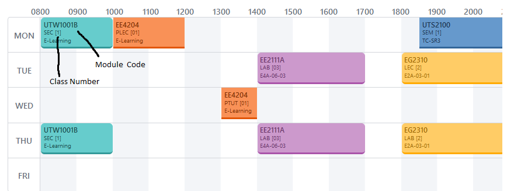
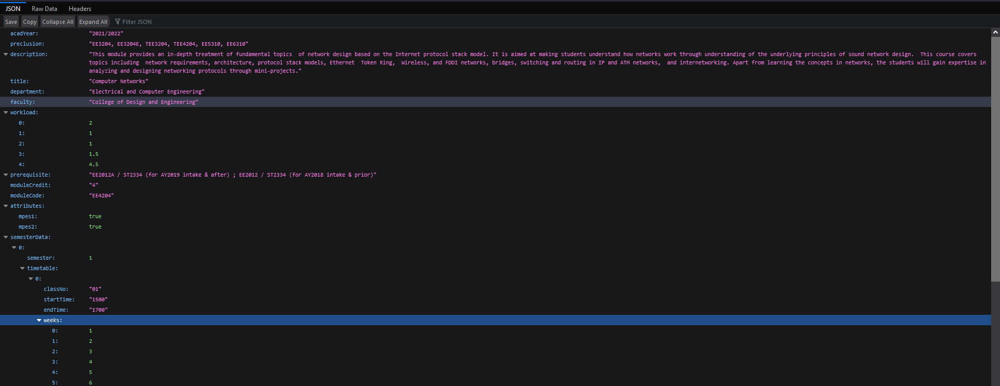

# LED Task Bot

## Description

Our bot is a 3 in 1 hardware system that infuses convenience and simplicity, making it fun and easy to keep your life organised.

## Components

Our bot is made up of three parts - a Module Timetable Reminder System, a Healthy Living Encouragement Tool as well as a Task Prioritization Organiser.

### Timetable Reminder System

Users can add modules to the system by inputting the module code and class number of their selected module into the telegram bot.

Our system will query the [NUS Mods API](https://api.nusmods.com/v2/) to get timing information about each module and class code entered.

Based on the information from the API endpoint, we can get the timings and days where the lessons will take place.

Then, our ESP8266 will keep track of the time and remind people about their lessons when their lessons are about to start. No reason to go to class late anymore!

### Healthy Living Encouragement Tool

Sitting around too long is bad for your health. That's why our Healthy Living Encouragement Tool surprises you with random reminders to do things that are beneficial to your health.

Just input the number of reminders you want the bot to have, as well as the time range you want to be reminded. Our bot will take care of the rest.

### Task Prioritization Organiser

Are you always unsure about how many tasks you have to complete at any given moment? Want to have fun but afraid of missing an important deadline? No problem! Our Task Prioritization Organiser makes it super simple to keep track of how many tasks you have, as well as how important each of those tasks are.

Only a few green LED lights show up? That's a cue that you can go have fun. But rack up too many red LED lights and you'll have to spend your time at home finishing your tasks.

## Motivation

We challenged ourselves to keep to as low of a budget as possible while still coming up with something that people would feel is useful. Something that we felt would fit this criteria would be a minimalistic system for self-organisation.

## Tech/Frameworks used

### Hardware

To build our bot, we used the [ESP8266](https://www.espressif.com/en/products/socs/esp8266), as well as a strip of LED lights.

### Software

We made use of the [Arduino IDE](https://www.arduino.cc/en/software).
